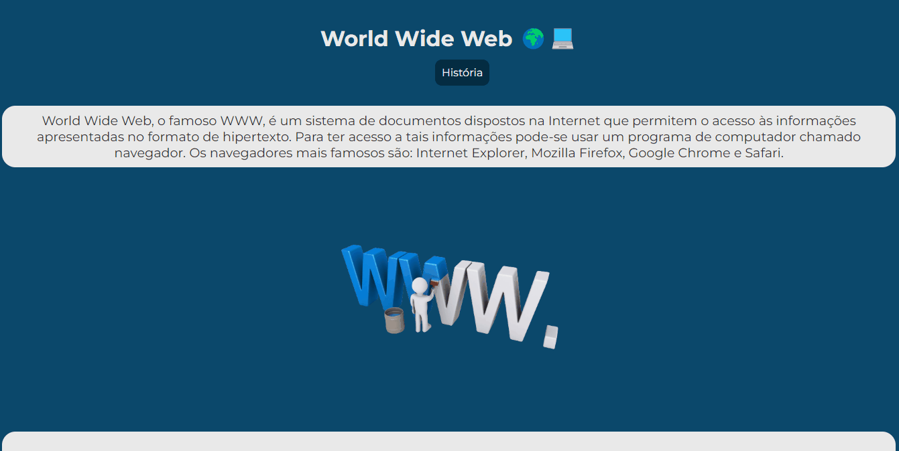

# Projeto Página de site 
Projeto de site sobre o World Wide Web "WWW". 🚀💻



# Tecnologias Utilizadas:
- HTML
- CSS
- JAVASCRIPT
# Como usar :
1 - Clone o projeto
```
git clone url
```
### ⚠️ O projeto terá atualizações.

### Obrigado por visitar meu projeto! ❤️
